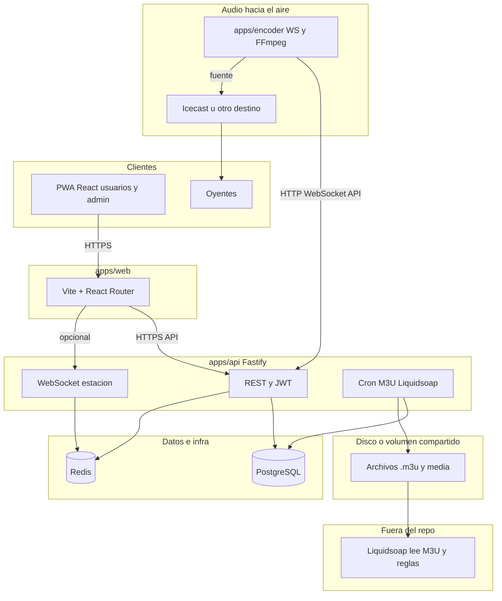

# Arquitectura de RadioFlow Studio

Este documento sustituye diagramas genéricos “Express + Liquidsoap directo” por **lo que implementa hoy el monorepo**. Actualizalo cuando cambien servicios o flujos.

## Vista general

## Decisiones que conviene tener claras

1. **API en Fastify**, no Express. Misma familia (Node.js, plugins, middleware), distinto framework.
2. **Bóveda de medios**: todos los MP3 (y derivados) usados al aire deben vivir bajo `MEDIA_ROOT`; las apps conectadas (encoder, widgets) consumen stream/API, no rutas sueltas del operador. Ver **[media-vault.md](./media-vault.md)**.
3. **Redis** aparece en Docker y en rutas en vivo; no está en diagramas viejos minimalistas pero forma parte del despliegue típico.
4. **Liquidsoap (legacy / opcional)**: la API **puede generar** artefactos M3U para un Liquidsoap externo. **No** es el path por defecto del producto: la salida al oyente es **encoder → Icecast**. No uses ambos a la vez sobre el mismo mount.
5. **Salida al oyente**: **encoder** (`apps/encoder`) → **Icecast/Shoutcast/AzuraCast** con contrato `PlaySegmentSpec` (cues, fundidos, ganancia) alineado a Cabina (A1). Con emisión activa (C1), Cabina hace listen-through del mismo mount (`publicListenUrl`); sin emisión, Web Audio local como fallback.
6. **Contrato A1 (`playSegment`)**: incluido en `GET /api/station` y WS; shared: `ApiPlaySegmentSpec` / `buildPlaySegmentSpec`.
7. **Headless A3**: sin UI, la API avanza la cola con duración real (`cueStart`→`cueEnd`, `durationSec`, o probe music-metadata/ffprobe). **No** usa un fallback fijo de 240 s; si no hay duración, gracia corta (~2.5 s) y skip con log `headless_playout`.
8. **Día-1 (A4)**: checklist operador instalar → biblioteca → Cabina → Icecast → Emitir en **[day-1-runbook.md](./day-1-runbook.md)**. Distinto del runbook de release/prod (`release-1.0-runbook.md`).
9. **Smoke broadcast (A5)**: `npm run smoke:broadcast` / `smoke:broadcast:mock` — FFmpeg→Icecast o encode mock con filtros de segmento; CI job `smoke-broadcast`.
10. **Backup firmado (A6)**: manifiestos SHA-256 (+ HMAC opcional) para Postgres (`drill:backup`) y desktop SQLite (`backup:desktop` / `backup:desktop:selftest`). Ver [backup-restore.md](./backup-restore.md).
11. **Alerta Icecast (A7)**: con `broadcastEnabled`, si la fuente del mount está caída &gt; `ICECAST_SOURCE_ALERT_AFTER_MS` → play-log `icecast_source_down` + `sourceAlert` en broadcast-status (+ webhook opcional).
12. **Soak 72 h (A8 / V1-06)**: criterios + evidencia en [staging-72h-soak.md](./staging-72h-soak.md); harness `npm run soak:watch` / `soak:sample` → `logs/soak/`. PASS firmado requiere ejecución real ≥ 72 h.
13. **Cabina B1**: layout estable (tabla scrollea; strip/dock/transporte fijos); sin toolbar/transporte/meta duplicados del shell; rieles opcionales.
14. **Desktop B2**: API embebida con `API_BACKGROUND_MODE=full`, cola `process-jobs` al arrancar, `AUDIO_FFMPEG_ENABLED` / ffprobe on; estado en `GET /api/health/meta` → `background` y pantalla Escritorio.
15. **Ads + parrilla (B3)**: checklist [b3-ads-parrilla-checklist.md](./b3-ads-parrilla-checklist.md); menú Lista inserta break; smoke profundo cubre `apply-active` + `ads/break`.
16. **Skip / AutoDJ / EOF (B4)**: contrato y tests en [b4-skip-autodj-eof.md](./b4-skip-autodj-eof.md); `npm run test:unit`; smoke profundo incluye skip + refill.
17. **Aire único / listen-through (C1)**: Cabina oye el mount público cuando hay emisión; encoder soberano — [c1-unified-air.md](./c1-unified-air.md).
18. **Voicetrack en el aire (C2)**: overlay A+VT en encoder (`voiceTrackOverlay`) — [c2-voicetrack-air.md](./c2-voicetrack-air.md).
19. **Scheduler consolidado (C3)**: un aplicador ScheduleBlock; mutex worker↔internal — [c3-scheduler-consolidated.md](./c3-scheduler-consolidated.md).
20. **ID3 round-trip (C4)**: DB ↔ archivo MP3 (`write-to-file` + relectura) — [c4-id3-write.md](./c4-id3-write.md).
21. **Cart/hotkeys (C5)**: `playNow` + menos RTT + toast desktop — [c5-cart-hotkeys.md](./c5-cart-hotkeys.md).

## Módulos UI alineados al producto

| Área | Dónde vive |
|------|------------|
| Consola admin (usuarios, eventos, sesiones) | `apps/web` · rutas `/admin/*` |
| Playlists, programación, informes | `apps/web` · rutas existentes |
| Marca / destino de streaming | API `settings` + `streaming` |

## Referencias

- [Runbook día-1 (primera emisión)](day-1-runbook.md)
- [Backup/restore firmado](backup-restore.md)
- [Soak 72 h (V1-06 / A8)](staging-72h-soak.md)
- [Operación y despliegue](operations.md)
- [Encoder → Icecast](streaming-encoder-icecast.md)
- [Nginx + Liquidsoap (equivalencias con compose genérico)](docker-edge-stack.md)
- [README principal](../README.md) — estructura del monorepo y endpoints
