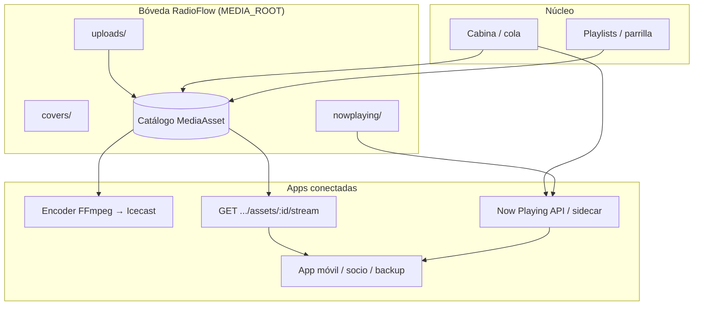

# Bóveda de medios — principio de producto

RadioFlow Studio debe **contener** (almacenar bajo su control) **todos los archivos de audio** que usa para reproducir en cabina y emitir hacia **aplicaciones conectadas** (encoder, widgets, apps asociadas, integraciones HTTP).

No es un reproductor que “apunta” a carpetas externas del usuario como fuente de verdad: la **bóveda** (`MEDIA_ROOT`) es el inventario físico; el catálogo SQLite/Prisma es el índice.

---

## Modelo objetivo

| Capa | Responsabilidad |
|------|-----------------|
| **Bóveda** | Copia local de MP3/WAV/… + carátulas + export now playing |
| **Catálogo** | Metadatos, rutas **relativas** a `MEDIA_ROOT`, duración, ganancia |
| **Cabina** | Solo reproduce `assetId` resolvibles dentro de la bóveda |
| **Conectadas** | Consumen **API/stream** o leen la **misma bóveda** en el mismo PC (encoder) |

---

## Dónde vive hoy (v0.1)

| Modo | `MEDIA_ROOT` | ¿Autocontenido? |
|------|----------------|-----------------|
| **Instalador Windows** | `%AppData%/…/userData/media` | **Sí** — diseño principal |
| **API local dev** | `apps/api/data/media` | Sí, si importás por upload |
| **Docker / servidor** | volumen `/app/media` | Sí, si todo entra al volumen |

### Importación

| Método | ¿Copia a bóveda? | Uso recomendado |
|--------|------------------|-----------------|
| Upload multipart (archivos / carpeta) | **Sí** → `uploads/` | **Canónico** |
| M3U con rutas absolutas (escritorio) | **Sí** (sube archivos) | OK |
| M3U “registrar en servidor” | **No** en modo `copy` (default) — solo en `register` si el archivo **ya** está bajo `MEDIA_ROOT` | Solo migraciones / admin |
| `POST /library/assets` con `path` | **No** en modo `copy` — registro de ruta existente en bóveda solo en `register` | Admin / scripts |

### Emisión hacia apps conectadas

| Consumidor | Cómo accede al audio |
|------------|----------------------|
| **Cabina (Web Audio)** | `GET /api/library/assets/:id/stream` |
| **Encoder** | Lee archivo en `RADIOFLOW_MEDIA_ROOT` (= `MEDIA_ROOT`) |
| **Now Playing / widgets** | `GET /api/public/now-playing`, sidecar JSON, carátula |
| **Icecast** | FFmpeg desde encoder (fuente = archivo en bóveda) |

---

## Reglas de diseño (north star)

1. **Un solo almacén** por instalación: `MEDIA_ROOT` (+ SQLite en el mismo `userData` en desktop).
2. **Toda pista en cola** debe tener `MediaAsset.path` resoluble **solo** bajo `MEDIA_ROOT` (`resolveAssetFilePath`).
3. **Import por defecto = copiar** (ingesta), no enlazar rutas `D:\Música\…` como catálogo permanente.
4. **Apps conectadas no dependen** de rutas del disco del operador; usan **API** o la bóveda compartida en el mismo host.
5. **Backup / migración** = copiar carpeta `media` + base de datos.

---

## Brechas actuales (a cerrar)

| ID | Brecha | Prioridad |
|----|--------|-----------|
| MV-1 | Modo “solo registrar” M3U/ruta sin copia — bloqueado por defecto (`LIBRARY_INGEST_MODE=copy`) | P1 — cerrado en Fase A |
| MV-2 | Sin API de **sincronización masiva** para app externa (listado + stream + etag) | P2 |
| MV-3 | Encoder en otro host exige **mismo volumen** o stream HTTP (no empaquetado aún) | P2 |
| MV-4 | Política `LIBRARY_INGEST_MODE=copy` rechaza `register_path` / M3U registrar | P1 — hecho (Fase A) |
| MV-5 | Explorador escritorio: confirmar que **siempre** pasa por upload (no referencia) | P1 |
| MV-6 | Documentar tamaño / rotación / backup de bóveda para clientes | P2 |

---

## Roadmap técnico sugerido

### Fase A — Política “bóveda estricta” (emisora standalone)

- [x] `LIBRARY_INGEST_MODE=copy|register` (default **`copy`**; desktop con `BOOTSTRAP_LOCAL_ADMIN` fuerza copy).
- [x] Al encolar: error claro si el archivo no está bajo `MEDIA_ROOT` o falta en disco (`VAULT_*`).
- [ ] Import carpeta → job en background que copia todo el árbol a `uploads/{categoría}/`.
- [x] UI: mensaje “La emisora guarda una copia en su biblioteca” (no atajos externos).

### Fase B — Contrato para apps conectadas

- [ ] `GET /api/public/now-playing` (hecho) + documentación OpenAPI.
- [ ] `GET /api/library/assets/:id/stream` con CORS/range para reproductores web.
- [ ] Opcional: `GET /api/public/station/media-feed` (lista ligera de lo al aire + siguiente).
- [ ] Sidecar `nowplaying.json` + `current-cover.jpg` (hecho, E1.3).

### Fase C — Encoder remoto sin disco compartido

- [ ] Encoder puede usar **solo HTTP stream** de la API cuando `RADIOFLOW_MEDIA_ROOT` vacío (FFmpeg `-i http://…/stream`).
- [ ] O empaquetar bóveda en NAS montado en API y encoder.

---

## Desktop vs servidor

| | Desktop (producto cliente) | Servidor (ops) |
|--|---------------------------|----------------|
| Objetivo | Una PC, todo local | Varios operadores, volumen Docker |
| Bóveda | `userData/media` | `radioflow_media` volume |
| Apps conectadas | Encoder local + widgets | Encoder contenedor + CDN |
| Principio | **Igual**: catálogo ⊆ bóveda | **Igual** |

---

## Referencias en código

- `MEDIA_ROOT` — `apps/api/src/config.ts`
- `LIBRARY_INGEST_MODE` — `apps/api/src/lib/library-vault.ts` (validación al encolar e import)
- Actualización automática — `apps/api/src/services/library-auto-update.ts` · config `{MEDIA_ROOT}/.radioflow/library-auto-update.json` · `LIBRARY_AUTO_UPDATE_POLL_MS`
- Resolución segura — `apps/api/src/lib/media-path.ts`
- Upload — `POST /api/library/upload`
- Stream — `GET /api/library/assets/:id/stream`
- Desktop bóveda — `apps/desktop/electron-main.cjs` (`userData/media`)
- Encoder — `apps/encoder` + `RADIOFLOW_MEDIA_ROOT`

Ver también: [architecture.md](./architecture.md), [streaming-encoder-icecast.md](./streaming-encoder-icecast.md).
