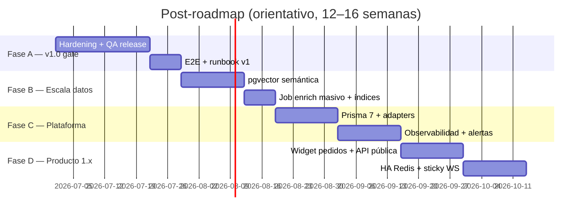

# Plan post-roadmap — v1.0 y más allá

RadioFlow Studio cerró **P0–P3** (v0.2, ~88 % producto integral). Este documento define la fase siguiente: **v1.0 comercial**, **hardening operativo** y **escala** (pgvector, multi-réplica, catálogos grandes).

Referencia cruzada: [roadmap.md](./roadmap.md) · [validation-checklist.md](./validation-checklist.md) · [README-prod.md](../README-prod.md)

**Leyenda:** 🔴 bloqueante v1.0 · 🟡 recomendado v1.0 · 🟢 post-1.0

---

## Visión v1.0

| Objetivo | Criterio |
|----------|----------|
| **Emisora 24/7 estable** | Cabina + encoder + Icecast sin intervención manual > 72 h en staging |
| **Instalable y actualizable** | Desktop Win + guía prod Docker; migraciones documentadas y probadas |
| **Seguro por defecto** | Sin admin bootstrap en Internet; JWT fuerte; rate-limits activos |
| **Observable** | Health/readiness, métricas Prometheus, logs estructurados mínimos |
| **Diferenciador claro** | Pedidos web + búsqueda semántica + ops en un solo panel |

**Versión objetivo:** `1.0.0` cuando **V1-01 … V1-06** estén ✅ (ver abajo).

---

## Fases (orden sugerido)



---

## V1 — Release gate (v1.0.0)

### V1-01 Hardening seguridad 🔴

| Ítem | Acción | DoD |
|------|--------|-----|
| Bootstrap admin | `BOOTSTRAP_LOCAL_ADMIN=0` obligatorio en prod; documentar primer admin | Checklist README-prod |
| Secretos | Validar `JWT_SECRET` ≥ 32 en CI smoke | Falla CI si débil |
| CORS | `CORS_ORIGIN` explícito en prod (no `*`) | `.env.example` + runbook |
| Dependencias | `npm audit` sin críticos conocidos; pin majors sensibles | Informe en release notes |
| Headers | Helmet + CSP revisada en Nginx edge | Scan manual / ZAP ligero |

### V1-02 Hardening operativo 🔴

| Ítem | Acción | DoD |
|------|--------|-----|
| Backup/restore | Drill documentado ejecutado 1× en staging | [operations.md](./operations.md) con fecha |
| Migraciones | Smoke `prisma migrate deploy` en CI contra Postgres efímero | Ya parcial en CI; añadir post-migrate queries |
| Graceful shutdown | Verificar SIGTERM en Docker/K8s (API + encoder) | Sin jobs colgados |
| Media vault | Disco lleno / permisos: errores claros en API | Prueba manual |
| Grabación stream | Estado multi-réplica (DB o Redis) si >1 API | Hoy in-memory; decidir MVP v1 |

### V1-03 QA y regresión 🔴

| Ítem | Acción | DoD |
|------|--------|-----|
| E2E | `npm run test:e2e` verde en CI (auth, evento, navegación) | Workflow obligatorio en PR |
| Checklist manual | [validation-checklist.md](./validation-checklist.md) 100 % en staging | Firma release |
| Desktop | Smoke `dist:win` en CI (build only); manual macOS/Linux 1× | Artefactos desktop-pack workflow |
| Paridad RB | [radioboss-parity.md](./radioboss-parity.md) sin 🔮 en ítems v1 | Revisión doc |

### V1-04 Documentación v1 🟡

| Entrega | Ubicación |
|---------|-----------|
| Runbook v1.0 | `docs/release-1.0-runbook.md` (derivado de 0.1) |
| Changelog | `CHANGELOG.md` desde tags |
| API | OpenAPI `/api/docs` con ejemplos semantic/requests |
| Ollama prod | README-prod § Ollama + modelos mínimos |

### V1-05 Empaquetado y versiones 🟡

| Ítem | Acción |
|------|--------|
| Semver monorepo | Alinear `package.json` root + apps a `1.0.0` |
| Desktop feed | Publicar `latest.yml` + NSIS en URL `RADIOFLOW_UPDATE_URL` |
| Docker tags | `radioflow/api:1.0.0` + `latest` en registry |

### V1-06 Criterios de aceptación comercial 🟡

- [ ] Emisora de prueba en staging ≥ 72 h sin caída de encoder/API — procedimiento: [staging-72h-soak.md](./staging-72h-soak.md) + `npm run soak:watch`
- [ ] Restore desde backup ≤ 30 min (RTO) — [backup-restore.md](./backup-restore.md)
- [ ] Login + cabina + playlist + stream + pedido moderado en un flujo demo grabado
- [ ] Build + E2E + migrate CI verdes en `main`

> A8 entrega el **harness y la plantilla de firma**. El checkbox de “≥ 72 h” solo se marca tras un soak real con `soak-summary-*.json` `"pass": true` y sign-off humano.

---

## H1 — Hardening profundo (post-gate, pre-escala)

Epic transversal; puede solaparse con V1.

| ID | Área | Ítems |
|----|------|-------|
| H1-01 | **Auth** | Rotación JWT planificada; 2FA admin (TOTP) opcional |
| H1-02 | **Rate limit** | Redis obligatorio en prod multi-réplica; métricas por ruta |
| H1-03 | **Auditoría** | Play-log export programado; retención configurable |
| H1-04 | **Secrets** | Soporte Docker secrets / K8s external secrets |
| H1-05 | **Streaming** | Reconexión encoder automática; alerta si `sourceConnected=false` > N min |
| H1-06 | **Scheduler** | Advisory lock compatible SQLite (desktop) + Postgres |
| H1-07 | **Tests** | Unit API: semantic-embeddings, playlist-render, song-request guard |

---

## S1 — Búsqueda semántica a escala (pgvector)

**Problema hoy (P3-02):** embeddings en `embeddingRef` (JSON); ranking en memoria sobre hasta 3 000 filas. Catálogos >10 k pistas degradan latencia y RAM.

### S1-01 pgvector en PostgreSQL 🟡

```sql
-- Migración orientativa
CREATE EXTENSION IF NOT EXISTS vector;
ALTER TABLE "MediaAsset" ADD COLUMN "embedding" vector(768);
CREATE INDEX ON "MediaAsset" USING ivfflat ("embedding" vector_cosine_ops) WITH (lists = 100);
```

| Paso | Detalle |
|------|---------|
| 1 | Migración Prisma raw + campo `Unsupported("vector")` o SQL manual |
| 2 | Backfill desde `embeddingRef` JSON existente |
| 3 | `semanticSearchAssets`: `ORDER BY embedding <=> $queryVector LIMIT 80` |
| 4 | Mantener JSON en `embeddingRef` como fallback / desktop SQLite |

**Dimensión:** alinear con `nomic-embed-text` (768) u otro modelo; documentar en env.

### S1-02 Job `semantic_enrich` 🟡

| Campo | Valor |
|-------|-------|
| Kind | `semantic_enrich` en `LibraryProcessJob` |
| Trigger | POST batch, auto al subir lote, cron nocturno |
| Progreso | `progressCurrent/Total` como otros jobs |
| Desktop | Sin pgvector: seguir scan en memoria o desactivar semántica vectorial |

**Backfill pgvector:** kind `pgvector_backfill` o `npm run pgvector:backfill` (copia `embeddingRef` → columna `embedding`).

### S1-03 Recomendaciones 🟢

- “Pistas similares” en detalle de asset (k-NN en pgvector)
- Playlist generator: boost por similitud a bloque anterior
- Cache de query embeddings (Redis, TTL 5 min)

### S1-04 Ollama en prod

| Opción | Cuándo |
|--------|--------|
| Ollama sidecar en mismo host | Emisora única, catálogo <20 k |
| Ollama dedicado + GPU | Enrich masivo / muchas consultas |
| API externa (OpenAI embeddings) | Fallback configurable `EMBEDDING_PROVIDER` |

---

## P1x — Plataforma y deuda técnica

| ID | Ítem | Notas |
|----|------|-------|
| P1x-01 | **Prisma 7** | [prisma-7-upgrade.md](./prisma-7-upgrade.md) — adapters pg + better-sqlite3 |
| P1x-02 | **Workers separados** | `library-process-worker` + `schedule-worker` en prod (`API_BACKGROUND_MODE=http-only`) |
| P1x-03 | **Observabilidad** | OpenTelemetry traces; Grafana dashboard (oyentes, skips, jobs) |
| P1x-04 | **Alertas** | Prometheus rules: API down, Icecast sin fuente, cola jobs failed > N |
| P1x-05 | **Redis HA** | Sentinel/cluster; pub/sub WS ya cableado (P2-05) |
| P1x-06 | **Sticky sessions** | Opcional si WS sin Redis; documentar nginx `ip_hash` |

---

## R1 — Producto 1.x (valor RadioFlow)

| ID | Ítem | Descripción |
|----|------|-------------|
| R1-01 | Widget pedidos | iframe `/requests?embed=1` + tema claro/oscuro |
| R1-02 | API pública read-only | Now playing + cola próxima sin auth (API key opcional) |
| R1-03 | Multi-estación | `stationId` ≠ `main` (schema hoy asume main) |
| R1-04 | Informes avanzados | CSV programado por email; gráficos oyentes 7/30 días |
| R1-05 | Auto-intro ML | Match por embedding de voz de intro vs pista |
| R1-06 | Liquidsoap bidireccional | Webhook Liquidsoap → API (now playing externo) |
| R1-07 | Mobile PWA ops | Transport cabina táctil; notificaciones pedidos pending |

---

## Matriz de prioridad (resumen ejecutivo)

| Prioridad | Epic | Semanas est. | Impacto |
|-----------|------|--------------|---------|
| 🔴 P0 | V1 release gate | 3–4 | Comercializable |
| 🟡 P1 | pgvector + enrich job | 2–3 | Catálogos grandes |
| 🟡 P1 | Hardening H1 | 2–3 | Confianza ops |
| 🟢 P2 | Prisma 7 + OTel | 2–4 | Mantenibilidad |
| 🟢 P2 | Producto R1 | continuo | Diferenciación |

---

## Métricas objetivo v1.0

| Métrica | v0.2 hoy | v1.0 target |
|---------|----------|-------------|
| Producto integral | ~88 % | ≥ 92 % |
| Paridad RB menús | ~97 % | ≥ 97 % (mantener) |
| Cobertura E2E flujos críticos | Parcial | 5 specs mínimos |
| P95 búsqueda semántica (10 k pistas) | N/A (scan RAM) | < 500 ms con pgvector |
| Uptime staging (7 días) | — | ≥ 99 % |
| Vulnerabilidades npm critical | Variable | 0 en release |

---

## Próximo paso inmediato (sprint 1 post-roadmap)

1. ~~**V1-03** — Endurecer CI: E2E obligatorio + job migrate post-deploy smoke.~~ ✅
2. ~~**V1-01** — Auditar `.env.prod` template y desactivar bootstrap en compose prod.~~ ✅
3. ~~**S1-01** — Spike pgvector: migración + query `<=>`.~~ ✅ (ver `pgvector-semantic.ts`)
4. ~~**V1-04** — Runbook [release-1.0-runbook.md](./release-1.0-runbook.md).~~ ✅

**Siguiente sprint 2:** ~~backup/restore drill~~ ✅ · ~~semver 1.0.0~~ ✅ · ~~job `semantic_enrich`~~ ✅ · ~~JWT audit CI~~ ✅

**Sprint 3 sugerido:** ~~tag git `v1.0.0`~~ (post-soak) · ~~72 h staging doc~~ ✅ · ~~npm audit gate~~ ✅ · ~~backfill pgvector~~ ✅

**Post-sprint 3:** ejecutar [staging-72h-soak.md](./staging-72h-soak.md) · `git tag v1.0.0` tras soak PASS · backfill en prod: `npm run pgvector:backfill`

---

## Referencias

- [Arquitectura](./architecture.md)
- [Operaciones](./operations.md)
- [Docker edge stack](./docker-edge-stack.md)
- [Paridad RadioBOSS](./radioboss-parity.md)
- [Migración Prisma 7](./prisma-7-upgrade.md)
