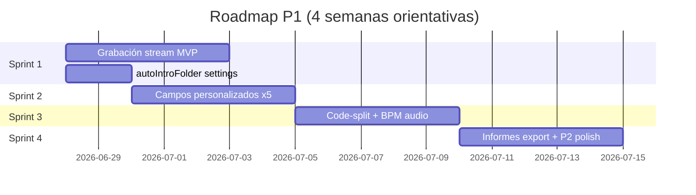

# Roadmap RadioFlow Studio

Priorización de producto alineada a paridad RadioBOSS y madurez operativa. Referencia cruzada: [radioboss-parity.md](./radioboss-parity.md).

**Leyenda:** P0 = bloqueante comercial · P1 = operación pro · P2 = pulido y escala

---

## Estado actual (v0.2)

| Métrica | Valor |
|---------|-------|
| Paridad menús RadioBOSS (RB) | ~97 % |
| Producto integral | ~88 % |
| Build / CI | ✅ Verde |

---

## P0 — Emisora en producción (cerrado)

Epics ya entregados; mantener regresión con CI.

| ID | Epic | Estado |
|----|------|--------|
| P0-01 | Cabina + cola + skip + crossfade | ✅ |
| P0-02 | Encoder → Icecast + metadatos Now Playing | ✅ |
| P0-03 | Biblioteca en bóveda + playout | ✅ |
| P0-04 | Playlist Generator Pro + scheduler eventos | ✅ |
| P0-05 | Publicidad (`/ads`) + jingles cart wall | ✅ |
| P0-06 | Auth multi-rol + refresh tokens | ✅ |

---

## P1 — Cierre de huecos operativos (cerrado)

| ID | Ítem | Prioridad | Estado | Notas |
|----|------|-----------|--------|-------|
| P1-01 | **Grabación de stream** | Alta | ✅ | `POST /streaming/record/*` · panel en `/streaming` |
| P1-02 | **Campos personalizados biblioteca (×5)** | Alta | ✅ | Etiquetas + valores · menú Biblioteca |
| P1-03 | **autoIntroFolder en Marca** | Media | ✅ | `/settings` · Operación al aire |
| P1-04 | BPM por análisis de audio | Media | ✅ | ffmpeg + autocorrelación · fallback si no hay TBPM |
| P1-05 | Code-split frontend (bundle &lt; 400 KB) | Media | ✅ | `React.lazy` por ruta · chunks vendor |
| P1-06 | Migraciones documentadas en README prod | Media | ✅ | Checklist + catálogo en `README-prod.md` §3 |
| P1-07 | Historial scheduler en panel lateral | Baja | ✅ | `GET /scheduler/runs` · `ShellSchedulerPeek` |

---

## P2 — Pulido “se siente RadioBOSS pro” (cerrado)

| ID | Ítem | Estado | Notas |
|----|------|--------|-------|
| P2-01 | Render playlist offline (mezcla a WAV/MP3) | ✅ | `POST /playlists/:id/render` · job `playlist_render` |
| P2-02 | Informes export CSV/PDF | ✅ | `/reports/*/export` · botones en `/reports` |
| P2-03 | TTS con motor configurable (edge-tts / Piper) | ✅ | `TTS_ENGINE` · selector en diálogo TTS |
| P2-04 | Auto intro por metadato ID3 dedicado | ✅ | `INTRO:` / `introMatchKey` · prioridad ID3 |
| P2-05 | Redis pub/sub WS multi-instancia | ✅ | Canal `radioflow:station:broadcast` |
| P2-06 | Grabación programada por evento scheduler | ✅ | `STREAM_RECORD_START` / `STOP` |
| P2-07 | macOS / Linux installers Electron | ✅ | `dist:mac` · `dist:linux` · pack script |
| P2-08 | Prisma 6.19 + revisión dependencias | ✅ | Prisma 7 → [prisma-7-upgrade.md](./prisma-7-upgrade.md) |

---

## P3 — Diferenciadores RadioFlow (cerrado)

| ID | Ítem | Estado | Notas |
|----|------|--------|-------|
| P3-01 | Pedidos web moderados (`/requests`) | ✅ | Público + moderación + peek |
| P3-02 | Búsqueda semántica Ollama | ✅ | Embeddings + enrich batch + UI biblioteca |
| P3-03 | Liquidsoap M3U + cron | ✅ | Cron + `GET /liquidsoap/*` |
| P3-04 | Ops / seguridad (`/security`) | ✅ | Menú cuentas → `/usuarios` |
| P3-05 | Desktop Electron + HUD VU + updates | ✅ | `RADIOFLOW_UPDATE_URL` al empaquetar |

---

## Post-roadmap (v1.0+)

P0–P3 cerrados. Siguiente fase documentada en **[post-roadmap-v1.md](./post-roadmap-v1.md)**:

| Fase | Foco |
|------|------|
| **V1** | Release gate v1.0 (hardening, QA, empaquetado) |
| **H1** | Seguridad y ops profundos |
| **S1** | pgvector + enrich masivo (catálogos >10 k) |
| **P1x** | Prisma 7, workers, observabilidad |
| **R1** | Widget pedidos, API pública, multi-estación |

---

---

## Criterios de “hecho” por épica P1

### P1-01 Grabación de stream
- [x] Iniciar / detener desde `/streaming` con destino activo
- [x] Archivo en `uploads/recordings/` bajo `MEDIA_ROOT`
- [x] Estado visible (duración, ruta)
- [x] Requiere `AUDIO_FFMPEG_ENABLED` y stream Icecast con fuente conectada

### P1-02 Campos personalizados
- [x] 5 etiquetas configurables (Biblioteca → Campos personalizados)
- [x] 5 valores por `MediaAsset` editables en biblioteca
- [x] Menú Biblioteca → Campos personalizados habilitado

### P1-03 autoIntroFolder
- [x] Campo en `/settings` persistido en `AppSettings`
- [x] Auto intro usa valor por defecto del servidor

---

## Referencias

- [Paridad RadioBOSS](./radioboss-parity.md)
- [Arquitectura](./architecture.md)
- [Checklist QA](./validation-checklist.md)
- **[Plan post-roadmap v1.0+](./post-roadmap-v1.md)** — hardening, pgvector, release gate
- **[Runbook release 1.0](./release-1.0-runbook.md)**
- **[Soak 72 h staging](./staging-72h-soak.md)**
